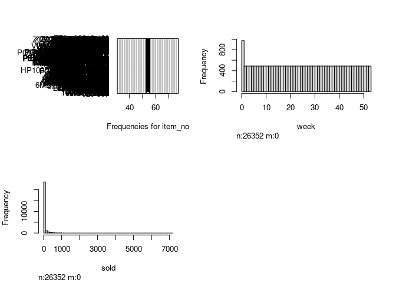

Activity 8 - Mini-competition
================

``` r
suppressPackageStartupMessages(library(tidyverse))
suppressPackageStartupMessages(library(tidymodels))
suppressPackageStartupMessages(library(GGally))
suppressPackageStartupMessages(library(ggfortify))
library(readr)
library(skimr)
library(broom)
library(psych)
suppressPackageStartupMessages(library(Hmisc))
```

``` r
inventory <- read_csv("inventory.csv",show_col_types = FALSE)
```

``` r
skimr::skim(inventory)
```

|                                                  |           |
|:-------------------------------------------------|:----------|
| Name                                             | inventory |
| Number of rows                                   | 26352     |
| Number of columns                                | 3         |
| \_\_\_\_\_\_\_\_\_\_\_\_\_\_\_\_\_\_\_\_\_\_\_   |           |
| Column type frequency:                           |           |
| character                                        | 1         |
| numeric                                          | 2         |
| \_\_\_\_\_\_\_\_\_\_\_\_\_\_\_\_\_\_\_\_\_\_\_\_ |           |
| Group variables                                  | None      |

Data summary

**Variable type: character**

| skim\_variable | n\_missing | complete\_rate | min | max | empty | n\_unique | whitespace |
|:---------------|-----------:|---------------:|----:|----:|------:|----------:|-----------:|
| item\_no       |          0 |              1 |   5 |  20 |     0 |       488 |          0 |

**Variable type: numeric**

| skim\_variable | n\_missing | complete\_rate |  mean |     sd |  p0 | p25 |  p50 | p75 | p100 | hist  |
|:---------------|-----------:|---------------:|------:|-------:|----:|----:|-----:|----:|-----:|:------|
| week           |          0 |              1 | 26.50 |  15.59 |   0 |  13 | 26.5 |  40 |   53 | ▇▇▇▇▇ |
| sold           |          0 |              1 | 50.62 | 230.24 |   0 |   0 |  0.0 |   2 | 7200 | ▇▁▁▁▁ |

``` r
hist.data.frame(inventory)
```

<!-- -->
